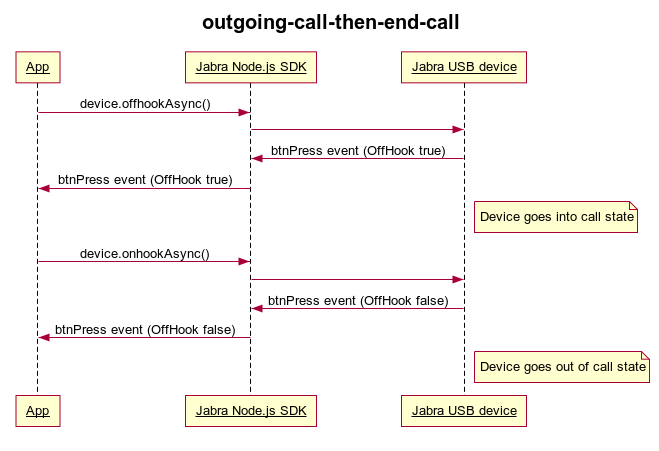
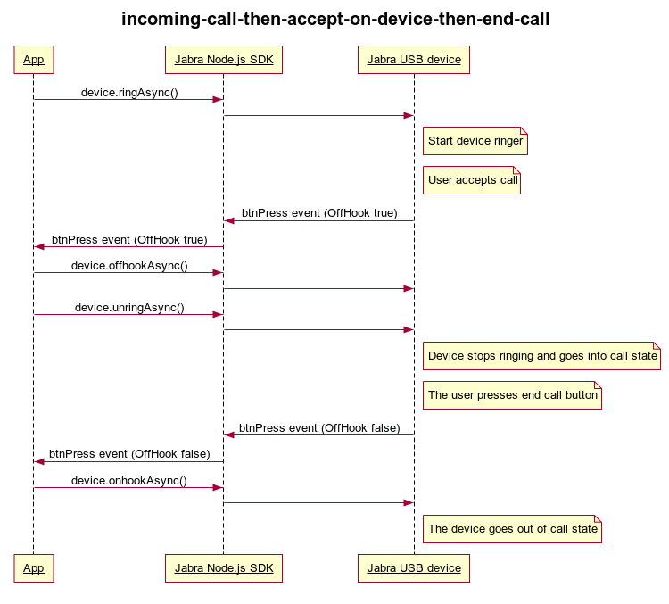
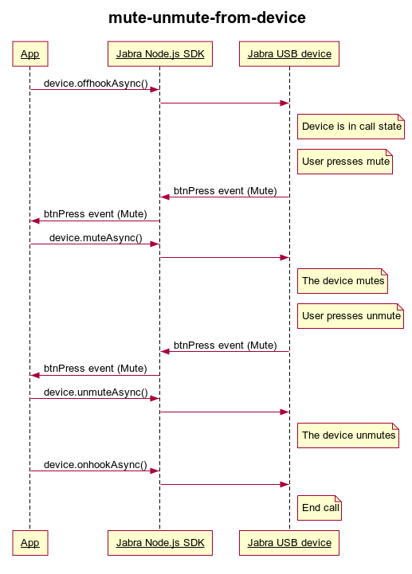
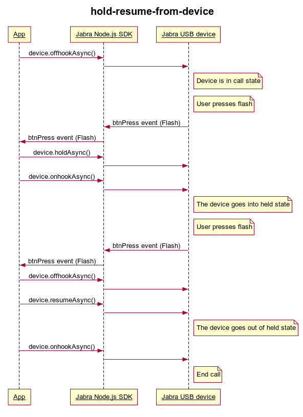

Jabra Node.js SDK - BETA RELEASE

# Table of Contents
- [Pre-requisite](#pre-requisite)
- [Installation](#installation)
- [Debugging and Logging](#debugging-and-logging)
- [API Reference](#api-reference)
- [Examples](#examples)
    - [Simple Example](#simple-example)
    - [Multiple device management](#multiple-device-management)
- [Bug report](https://github.com/gnaudio/jabra-node-sdk#bug-reports)
- [Changelog](https://github.com/gnaudio/jabra-node-sdk/blob/master/CHANGELOG.md)
- [License](https://github.com/gnaudio/jabra-node-sdk/blob/master/LICENSE.md)
- [FAQ](https://github.com/gnaudio/jabra-node-sdk/blob/master/FAQ.md)

**Warning: ALL software released here is in BETA. All software can be considered unstable, possibly untested and might be updated at any time. In addition, this documentation is not fully updated. Use at your own risk. If you want to use something stable, please await completion of our development and Q/A process OR consider using our previous ["jabra" npm](https://www.npmjs.com/package/jabra) package (until it will be deprecated at a later stage).**

## Pre-requisite
1. Node.js v8.x or later.
2. **On MacOS:** `xcode` & `python 2.7`. By default, Python is installed on macOS but make sure correct version(2.7.x) is installed. Install Xcode from App store or download it from [here](https://developer.apple.com/xcode/download/).
3. **On Windows:** `Visual C++ Build Tools` & `Python 2.7`. You can install all of these using command `npm install --global --production --add-python-to-path windows-build-tools`. To know more about this tool, see [this link.](https://github.com/felixrieseberg/windows-build-tools).
4. **On Linux:** `build-essential` package for C++ compilation & `Python 2.7`.

    4.1. **Udev rules:** To be able to communicate with Jabra devices with non-root privileges it is required to create a udev rule for Jabra devices. Place the udev rule in `/etc/udev/rules.d`, and follow naming guidelines for udev files.              **Example:** The file name should be something like `80-jabra.rules` where the number before the dash indicates in what order the system reads the rules (e.g. if you had another rules file called `70-someotherrule.rules`, it would read that one first), the word after the dash is just an identifier of sorts (it could be something other than jabra) and the extension must be `.rules`.
    The contents of the file are:
    `ATTRS{idVendor}=="0b0e", MODE="0666", GROUP="users"`
    After creating the udev file (as root), reload the udev rules using:
    `sudo udevadm control --reload`
    Reattach your Jabra device in order to get new permissions assigned.

5. **All Platforms:** `node-gyp`. You can install this using command `npm install -g node-gyp`. To know more about this, see [this link](https://www.npmjs.com/package/node-gyp)

6. **For Electron.JS:** If you are using `asar` packaging then you may need to `unpack` some of the resources used in this module. These resources are native library files i.e `libjabra.dll`, `libjabra.dylib` & `libjabra.so`, which is stored in a `build\Release` folder. By default latest electron builder will automatically unpack, but if it does not work then you can provide below option to your build process. To know more, see [this link](https://www.electron.build/configuration/configuration)

    ```
    "build": {
        "asarUnpack": ["node_modules/@gnaudio/jabra-node-sdk"]
    }
    ```

## Installation
This release is published to [npm](https://www.npmjs.com/package/@gnaudio/jabra-node-sdk) and can be installed via below command.
```
npm install --save @gnaudio/jabra-node-sdk
```

## Debugging and Logging
Below environment variables are defined for logging and debugging purpose. User can change the values as per preference.

Environment Variable | Value | Description
--- | --- | ---
LIBJABRA_TRACE_LEVEL | fatal, error, warning(default), info, debug | Log levels
LIBJABRA_RESOURCE_PATH | **On Mac:** ~/Library/Application Support/JabraSDK/ **On Windows:** %appdata%/Roaming/JabraSDK  | This determine the system path where logs and device related files are written.

## API Reference
API doc is in html format. See doc folder inside installed module `node_modules\@gnaudio\jabra-node-sdk\dist\doc` and open `index.html`.

## Examples

For all examples, user should first register the app on [Jabra developer site](https://developer.jabra.com/) to get appID. User should pass this appID to `createJabraApplication` in order to initialize the jabra module:

### Simple button events example using javascript and plain promises

```javascript
const j = require("@gnaudio/jabra-node-sdk");
j.createJabraApplication('123').then((jabra) => { // 123 is appID here
    jabra.on('attach', (device) => {
        console.log('Press any key on Jabra device ' + device.deviceName);
        
        // If you are creating a softphone, consider using GN protocol when device supports it
        // in order to receive all events. E.g. device.setHidWorkingStateAsync(j.enumHidState.GN_HID);
        device.on('btnPress', (btnType, btnValue) => {
          console.log('New input from device is received: ', j.enumDeviceBtnType[btnType], btnValue);
        });
    });    
});
```

### Simple button events example using typescript and plain promises

```typescript
import { createJabraApplication, enumDeviceBtnType, enumHidState } from '@gnaudio/jabra-node-sdk';
createJabraApplication('123').then((jabra) => { // 123 is appID here
    jabra.on('attach', (device) => {
        console.log('Press any key on Jabra device ' + device.deviceName);

        // If you are creating a softphone, consider using GN protocol when device supports it
        // in order to receive all events. E.g. device.setHidWorkingStateAsync(enumHidState.GN_HID);
        device.on('btnPress', (btnType, btnValue) => {
          console.log('New input from device is received: ', enumDeviceBtnType[btnType], btnValue);
        });
    });    
});
```

### Ring example using typescript and plain promises
This example shows how to ring a Jabra device

```typescript
import { createJabraApplication, JabraError } from '@gnaudio/jabra-node-sdk';

createJabraApplication('123').then((jabra) => { // 123 is appID here
    jabra.on('attach', (device) => {
        device.isRingerSupportedAsync().then( (supported) => {
            if (supported) {
              device.ringAsync().then ( () => {
                console.log('ringing');
              }).catch ((err: JabraError) => {
                console.log('ring failed with error ' + err);
              }); // ring the device
              setTimeout(() => {
                device.unringAsync().then(() => {
                    console.log('stopped ringing');
                }).catch ((err: JabraError) => {
                    console.log('unring failed with error ' + err);
                });
              }, 5000); // stop ringing the device after 5 second
            }          
        }).catch( (err: JabraError) => {
            console.error('Jabra call failed with error ' + err)
        });
    });
    
    jabra.on('detach', (device) => {
        console.log('Device detached with deviceID:', device.deviceID);

        // In this demo example, we will auto shutdown once all jabra devices are removed:
        let remainingAttachedDevices = jabra.getAttachedDevices();
        if (remainingAttachedDevices.length == 0) {
            jabra.disposeAsync().then (() => {}); // Cleanup and allow node process to exit.
        }
    });
});
```

### Multiple device management with typescript and async/await

```typescript
import { createJabraApplication } from '@gnaudio/jabra-node-sdk';

(async () => {
    let jabra = await createJabraApplication('123'); // 123 is appID here

    await jabra.scanForDevicesDoneAsync(); // Wait for all pre-attached devices to be scanned.

    const deviceInstanceList = jabra.getAttachedDevices();
    if (deviceInstanceList.length<2) {
        throw new Error('Please make sure 2 jabra devices are attached');
    }

    const firstDevice = deviceInstanceList[0];
    await firstDevice.ringAsync();

    const secondDevice = deviceInstanceList[1];
    await secondDevice.ringAsync();

    // Dispose jabra sdk to enable node process to shutdown.
    await jabra.disposeAsync();
})();
```

## Sequence diagrams

These sequence diagrams shows typical use of the Node.js sdk:









